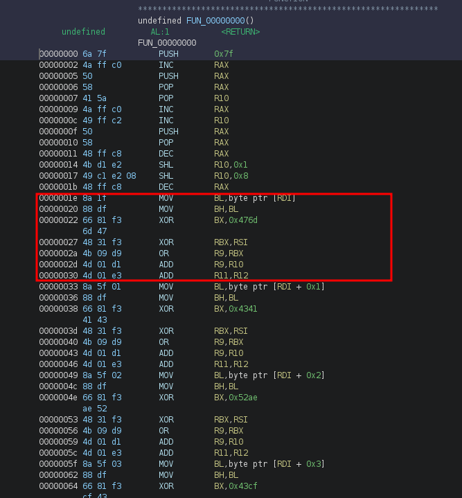

# ShuffleMe

ShuffleMe is a reverse challenge from the FCSC edition 2021 from Cryptanalyse.

> Recover the inputs to get the flag.

> ``shuffleMe`` - 22.02 KiB


### Initial recon

We are facing a stripped ELF 64-bit executable, the binary is asking for an secret from the ``argv[1]``, then a input from ``stdin``.

```c
int main(int argc,char **argv)

{
  uint8_t buffer [80];
  long local_18;
  int local_c;
  
  if (argc != 2) {
    fprintf(stderr,"Usage: %s <secret>\n",argv[1]);
    exit(1);
  }
  local_c = atoi(argv[1]);
  memset(buffer,0,80);
  __isoc99_scanf("%70s",buffer);
  local_18 = FUN_401230(buffer,local_c);
  if (local_18 == 0x460000) {
    puts("Yay!");
  }
  else {
    puts("Nope.");
  }
  return 0;
}
```
*For this writeup, I will use the base address ``0x400000``*

The following function can look weird, the ``FUN_401230`` function call ``FUN 401245`` which seems to end quite suddenly.

```asm
00401245 41 58           POP        R8
00401247 49 83 c0 38     ADD        R8,0x38 ; The next instruction after 0x0040127b

0040124b 50              PUSH       RAX     ; The Buffer
0040124c 48 89 f0        MOV        RAX,RSI ; Store the secret to RAX
0040124f 48 c7 c1        MOV        RCX,0xb5
         b5 00 00 00
00401256 48 f7 e1        MUL        RCX
00401259 48 05 d9        ADD        RAX,0xd9
         00 00 00
0040125f 48 c7 c1        MOV        RCX,0x200
         00 02 00 00
00401266 48 f7 f1        DIV        RCX
00401269 48 89 d6        MOV        RSI,RDX
0040126c 48 89 f1        MOV        RCX,RSI
0040126f 48 c1 e1 04     SHL        RCX,0x4
00401273 4c 01 c1        ADD        RCX,R8
00401276 58              POP        RAX
00401277 49 83 eb 07     SUB        R11,0x7
0040127b ff e1           JMP        RCX
```

By manually disassembling the code after ``0x40127b`` we can see a pattern: one instruction, a tiny NOP sled, then a jump to ``0x40124b``.

From here, the challenge start drawing by itself, our secret input will be used to select which instruction jump, then the next instruction will be resolved and so on.

This is a kind of Control Flow Flattening protection, but in our case it's up to the user to choose the instruction flow.

### Introduction

The first thing that will help us in the analysis is to get all the possible RCX value from our secret input.

We can manually get the operation and re-write them to a z3 script, it's not even 10 instructions.

```py
import z3
MASK = 0xffffffffffffffff
def find_solution(target_addr):
    s = z3.Solver()
    rax = z3.BitVec("reg_RAX", 32) # our 32 bit input
    r8 = 0x40127d # addr of jmp rcx

    constraints = (((( (rax*0xb5)& MASK)+ 0xD9) & MASK)%0x200)

    s.add(((constraints<<4)+r8)==target_addr) # RCX computed value

    if s.check() == z3.sat:
        model = s.model()
        for model_index, _ in enumerate(model):
            return int(str(model[_])) # just one solution
        
    else:
        print("No solution found !")
        exit(1)

```

The last task that could be done manually is getting all the target address and link them to the a secret value.

By copying the instruction set from ``0x40127d`` to ``0x403278`` using ``objdump`` or ``ghidra`` and 2 minutes of pasting using [Cyberchef](https://cyberchef.org/#recipe=Find_/_Replace(%7B'option':'Regex','string':'.*JMP.*'%7D,'',true,false,true,false)Find_/_Replace(%7B'option':'Regex','string':'.*NOP.*'%7D,'',true,false,true,false)Find_/_Replace(%7B'option':'Extended%20(%5C%5Cn,%20%5C%5Ct,%20%5C%5Cx...)','string':'%20%20'%7D,'',true,false,true,false)Regular_expression('User%20defined','%5E00%5C%5CS*',true,true,false,false,false,false,'List%20matches')) we can have the list of the instructions address.

```py
target_addrr = [4200717, 4200733, 4200749, 4200765, 4200781, ...]
instr2secret = {}
for addrr in target_addrr:
    instr2secret[addrr] = find_solution(addrr)
```

### Reversing the Control Flow

It's not possible to find the flag if I don't have the code that will check it, so the first step is to find the secret.

Solving this type of challenge can be quite a pain, hopefully, [the Miasm framework](https://github.com/cea-sec/miasm) will help us.


The idea is to emulate ``FUN_00401230`` with the constants found previously for each instruction, store the shellcode generated, and then use a ``symbolic execution engine`` to find the target return address (0x460000).

With this script I can get the shellcode for every secret value.

```py
import pathlib
from miasm.jitter.jitload import JitterException
from miasm.analysis.binary import Container
from miasm.analysis.machine import Machine
from miasm.core.locationdb import LocationDB
from miasm.jitter.csts import PAGE_READ, PAGE_WRITE,EXCEPT_SYSCALL, PAGE_EXEC
from miasm.arch.x86.arch import mn_x86
from miasm.expression.expression import *

from my_z3_script import instr2secret

shellcode = b""

def supervisor(jitter):
    global shellcodes go back to 
    RCXValue = jitter.cpu.RCX
    
    blk = mdis.dis_block(RCXValue)
    if(RCXValue == blk.lines[0].offset): # Just to make sure i really execute the instruction
        print(blk.lines[0], hex(blk.lines[0].offset)) # print the shellcode instr per instr
        shellcode = shellcode+mn_x86.asm(blk.lines[0])[0] # get the bytecode

    jitter.running = True # continue the execution
    return True


def end_shellcode(jitter):
    global shellcode
    print(shellcode)
    # Now use symbolic execution to find rax=0x460000
    shellcode = b""
    jitter.running = False
    return False

entry1 = b"A"*70 # garbage input


path = str(pathlib.Path(__file__).parent.absolute())+"/"
f = open(path+"shuffleMe", 'rb')
data = f.read()
f.close()
loc_db = LocationDB()
cont = Container.from_string(data, loc_db)
machine = Machine("x86_64")
mdis = machine.dis_engine(cont.bin_stream, loc_db=loc_db)

def init_jit():
    global myjit
    myjit = machine.jitter(loc_db)
    myjit.init_stack()
    base_addrr = 0x00400000
    myjit.vm.add_memory_page(base_addrr, PAGE_READ | PAGE_WRITE | PAGE_EXEC , data)
    myjit.vm.add_memory_page(0xdead0000, PAGE_READ , entry1)


    myjit.cpu.RDI = 0xdead0000
    myjit.cpu.RAX = 0xdead0000
    myjit.add_breakpoint(0x0401205, end_shellcode)
    myjit.add_breakpoint(0x40127b, supervisor)


init_jit()

for addrr, secret in instr2secret.items():
    print(secret)
    entry2 = secret
    myjit.cpu.RSI = entry2
    myjit.cpu.RDX = entry2
    try:
        myjit.run(0x401200)
    except JitterException: # Some address point will make the program crash
        print("Error for: ",hex(addrr), f"({secret})")
        myjit.running = False
        init_jit()
```

The next step with the symbolic execution didn't work, the result was hardly parsable, and the amount of time to handle over the 500 possibilities would be too big. I found a better solution.

The instruction flow created from our secret will define the entry point of the shellcode, but the next address will follow the same set until the end.

**NOTE** The shellcode is linear, which means there are no conditions or jumps.

By setting the secret value, we finally only select where we start in the shellcode.

The next step is to count all the instructions for each entry point, then sort all the values. The entry with the most of instructions will logically be the plain shellcode.

Some adjustments will be needed:

```py
def supervisor(jitter):
    global global_count
    RCXValue = jitter.cpu.RCX
    
    blk = mdis.dis_block(RCXValue)
    if(RCXValue == blk.lines[0].offset):
        global_count+=1
    jitter.running = True
    return True
# [...]
def end_shellcode(jitter):
    global global_count

    entry_count[global_secret] = global_count
    print(global_secret,":",entry_count[global_secret])
    jitter.running = False
    return False
# [...]
for addrr, secret in my_z3_script.instr2secret.items():
    global_count = 0
    global_secret = secret
    entry2 = secret
    myjit.cpu.RSI = entry2
    myjit.cpu.RDX = entry2
    try:
        myjit.run(0x401200)
    except JitterException as e:
        print("Error for: ",hex(addrr), f"({secret})")
        myjit.running = False
        init_jit()
        
print(dict(sorted(entry_count.items(), key=lambda item: item[1]))) # sorted result
```

As exepted, after 5 minutes I finally have the sorted result.

From:

- ``2752575725`` : The secret value to get directly the ``RET`` instruction, size 1.


To:

- ``972893146`` : The secret value to directly go at the begin of the shellcode, size 511.

Let's go back to our code from earlier and dump the shellcode from the secret ``972893146``, save the shellcode, and then analyze it. I use ghidra by manually selecting the language x86 64 bits (because there's no metadata).

The shellcode is pretty simple.



The red-framed part is the same for every byte of the flag (stored in ``RDI``).

I have chosen to parse using z3 (again), symbolic execution for later :(

Using gdb I'll get dynamically the state of the registers (at ``0x0000001e``).

```py
RBX = 0
R9 = 0
R10 = 0x10000
R12 = 0x33
```

Because I'm lazy and I already have the tool in hand, I'll modify the supervisor function to get the list of constants xored to BX and the RSI value (which is the seed for the next instruction).

I'm sure it will work, and it relieves me of potential calculation errors.

```pyay find handy as well:. gem install will install the nam
def supervisor(jitter):
    global shellcode
    global global_count
    global RSI_array
    global BX_array
    RCXValue = jitter.cpu.RCX
    jitter.running = True
    blk = mdis.dis_block(RCXValue)
    if(RCXValue == blk.lines[0].offset):
        if blk.lines[0].name =="XOR" and blk.lines[0].args[0] == ExprId('RBX', 64) and blk.lines[0].args[1] == ExprId('RSI', 64):
            RSI_array.append(jitter.cpu.RSI)
        if blk.lines[0].name =="XOR" and blk.lines[0].args[0] == ExprId('BX', 16) and type(blk.lines[0].args[1]) == ExprInt:
            BX_array.append(int(blk.lines[0].args[1]))

        print(blk.lines[0], hex(blk.lines[0].offset))
    return True
```

We now have everything in hand to solve this challenge.

```py
import z3
RSI_val = [299, 2, 509, 140, 351, 358, 465, 272, 467, 10, 485, 212, 135, 494, 57, 472, 379, 274, 205, 28, 175, 374, 417, 416, 35, 282, 181, 100, 471, 510, 9, 104, 459, 34, 413, 428, 511, 390, 369, 48, 115, 42, 389, 500, 295, 14, 473, 248, 27, 306, 109, 316, 335, 406, 321, 192, 195, 314, 85, 388, 119, 30, 425, 392, 107, 66, 317, 204, 159, 422]
BX_val = [18285, 17217, 21166, 17359, 31268, 24583, 26551, 13090, 13281, 25449, 26499, 25776, 25827, 13786, 13839, 25530, 26397, 25201, 14581, 12589, 12447, 13379, 25282, 25538, 12817, 14626, 26064, 12372, 13795, 14535, 14385, 14416, 26541, 14619, 12717, 13720, 12751, 13746, 14408, 25684, 25623, 13852, 12725, 25494, 25666, 12607, 13291, 13516, 13614, 13829, 12636, 14596, 26409, 26608, 25636, 26278, 13814, 25432, 14700, 25574, 25109, 26232, 14480, 25578, 13662, 12402, 14340, 25768, 13738, 31963]
s = z3.Solver()

flag = [z3.BitVec(f"flag({i})", 8) for i in range(70)]
RBX = 0
R9 = 0
R10 = 0x10000
R12 = 0x33

for i in range(0, 0x46):
    RBX = ((flag[i]<<8)|flag[i])
    RBX = RBX^BX_val[i]
    RBX = RBX^RSI_val[i]
    R9 = R9|RBX
    R9 = (R9+R10) & 0xffffffffffffffff

RAX = R9

s.add(RAX==0x460000)
if(s.check() == z3.sat):
    model = s.model()
    flag = "".join([chr(model[flag[i]].as_long()) for i in range(70)])
    print(flag)

else:
    print(":(")
```

**FLAG :** ``FCSC{af22cfdd46bfc8105cb28e04988f904049dd60be1245718ffef5b9bbf9b509d5}``

### Conclusion

Nice challenge. You need a little organization for this kind of challenge. There are a lot of steps, but it remains a very nice puzzle type.
